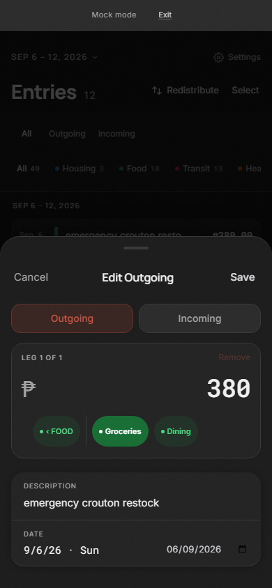
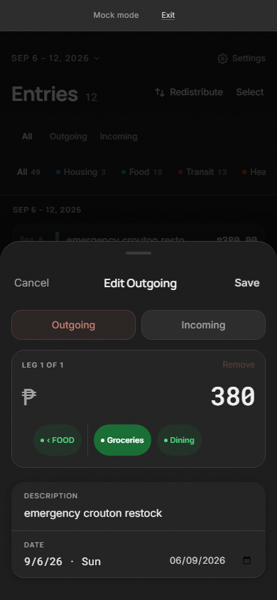
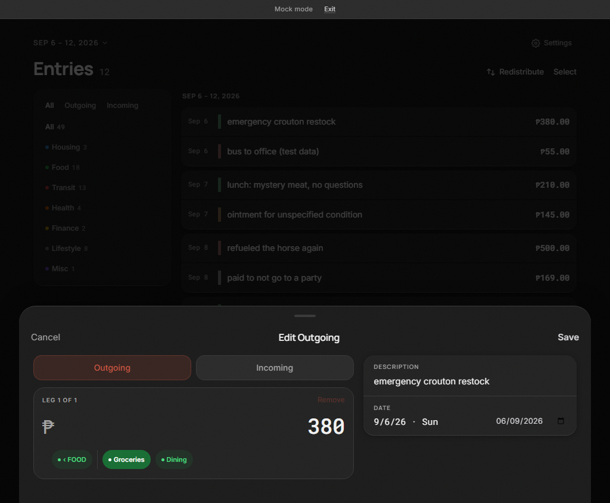
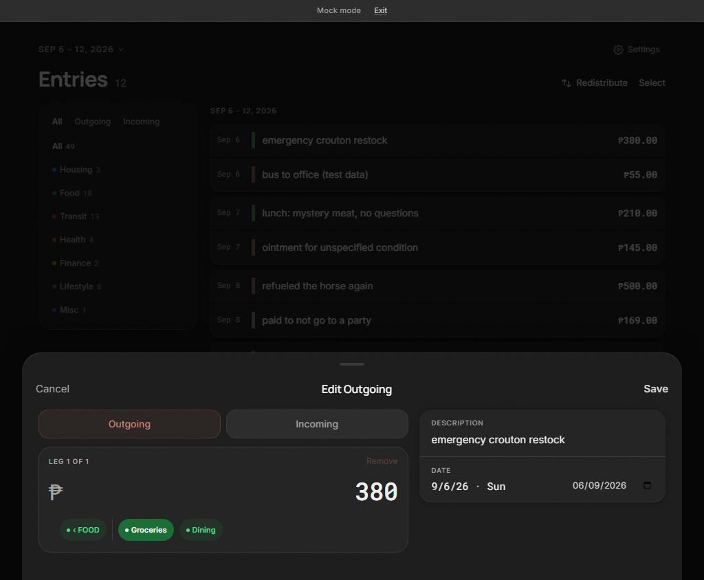
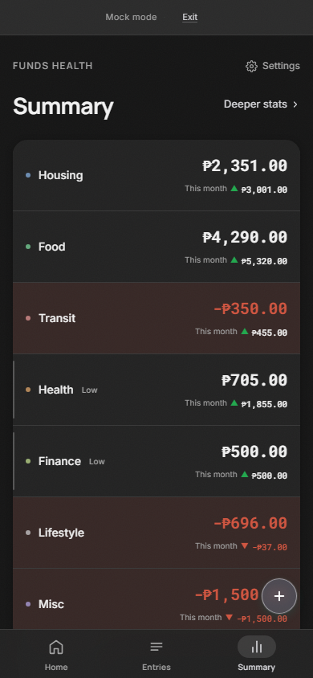
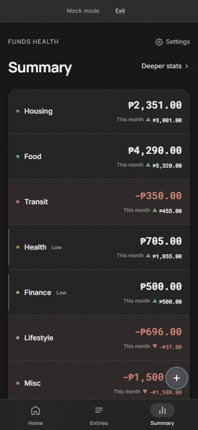
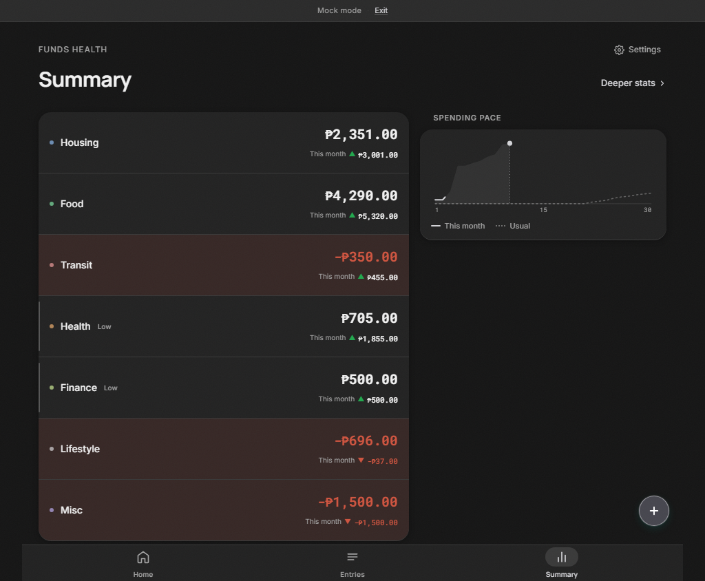
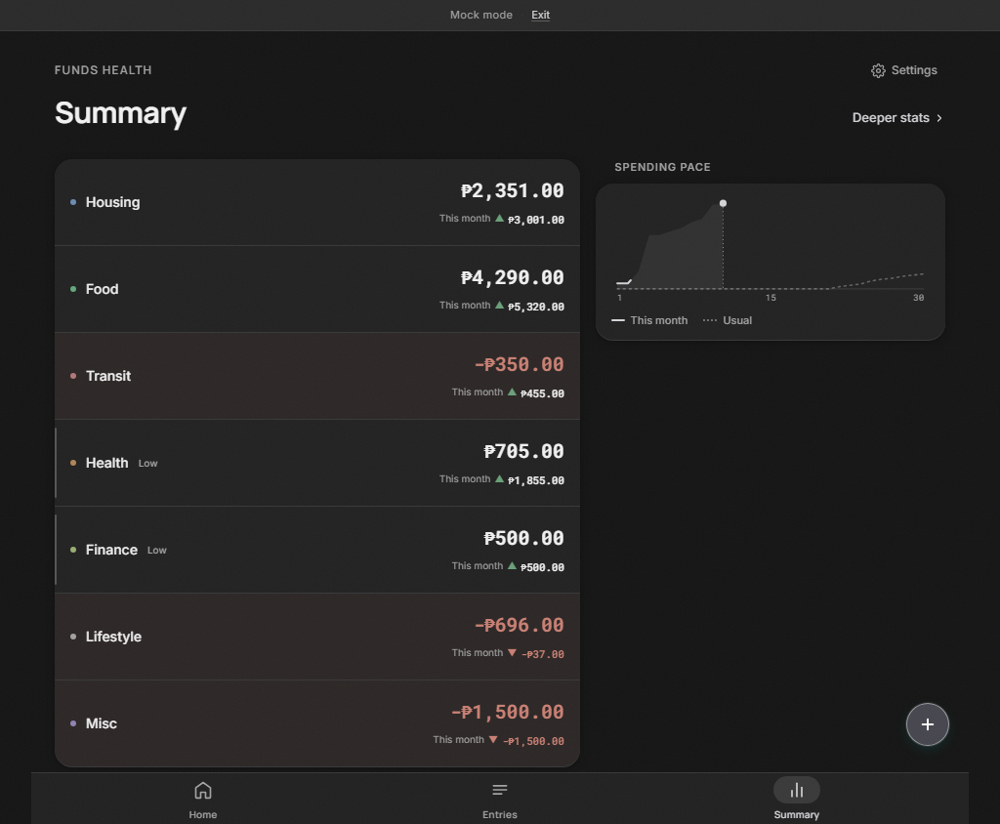

# Dark semantic colors — issue #215

Dark semantic text now uses muted salmon, sage, and indigo channels at 90% foreground alpha. Destructive and positive surfaces derive independently from their hue channels. Solid destructive buttons darken the same source hue to retain white-label contrast. Light channels and role alphas retain their original values.

`frontend/src/app.css` owns the canonical dark palette, shadows, and gradient values. The system and explicit dark selectors retain separate activation mappings to those sources. Category colors, neutral surfaces, accent behavior, typography, and layout retain their existing definitions.

| Role | Dark channels / treatment |
| --- | --- |
| Destructive | `220 139 125`, foreground alpha `.9` |
| Positive | `115 174 131`, foreground alpha `.9` |
| Local Entry | `153 158 205`, foreground alpha `.9` |
| Destructive surface / strong / selected | `.06` / `.08` / `.04` |
| Destructive border / strong border | `.18` / `.26` |
| Positive surface / border | `.06` / `.18` |
| Solid destructive fill | 65% destructive channels mixed with black |

## Browser evidence

Deterministic Mock Mode, Windows Chromium, loaded local fonts, fixed September 11, 2026 clock, reduced motion, 390×844 and 1024×844 viewports. Eight light screenshots were captured before implementation and retained without regeneration. Final comparisons use zero differing pixels and zero color threshold. A temporary foreground perturbation failed the preservation guard; restoring the CSS restored passing comparisons.

Incremental failing tests demonstrated the original destructive direction tint, Incoming foreground, and Local Entry border before each corresponding fix. Browser checks composite alpha and ancestor opacity against rendered backgrounds: semantic text and destructive button labels meet 4.5:1; the Local Entry border and Incoming chart bar (including its existing `.85` opacity) meet 3:1. Settings switching, OS scheme changes, explicit preference precedence, and explicit/system dark agreement pass, including a Category consumer.

Screenshot assertions use the committed Windows baselines only on Windows. The rendered-color, contrast, and preference checks run on every host. Category palette brightness remains outside this change. Existing bulk-selected rows render with the card background because the card utility wins over the selected tint utility; this behavior is unchanged, and contrast is checked against its actual background.

## Visual comparisons

Reviewed mobile and desktop Home, Entries, Summary, and Edit Entry screenshots. Representative comparisons:

| View | Before | After |
| --- | --- | --- |
| Mobile Edit |  |  |
| Desktop Edit |  |  |
| Mobile Summary |  |  |
| Desktop Summary |  |  |

## Validation

- `npm run check`: 0 errors, 0 warnings.
- `npm run test:run`: 761 passed, 4 existing live-store tests skipped; 49 test files passed.
- `npm run build`: production build passes; existing `darkMode.svelte.ts` initial-state reference warning remains.
- `npm run test:e2e`: 86 tests pass; final strengthened theme assertions also run in the focused 8-test suite.
- The browser suite uses Mock Mode for CRUD; its existing API spec also performs a read-only GAS check. No live mutation suite was run.
